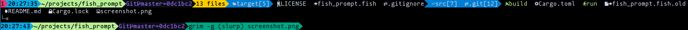

# Requirements
- Any [nerd font](https://www.nerdfonts.com)
- A [Fish](https://fishshell.com)

# Overview
This is my fish prompt file. That's it.

It prints out the status of the previous command (and all the pipes after), if it is not zero, at the beginning of the line.
Next is the time. After the time is the current working directory.
Then we have the git area. If the current folder is not part of a git repo, this is just 2 characters of grey (both arrows).
After the git area we go to the file listing. I think this is useful. It displays how many items are in the current directory (files, links, folders, regardless of permissions). It then prints out the contents in whatever order `ls -1A` lists them. The different entries (folder, file, link) have different colors. The file entry has a different color for block and character devices (in /dev). I have done a large if-else if-else block to detect file types and some folder names to give them different icons. For example, all `*.rs` files get the nerd font rust logo. I have a config option (`MAX_LINES`) that specifies how many additional lines the file lister can use (if set to zero, we will only use the line that the CWD is on).

# Screenshots

# License
[The Unlicense](https://unlicense.org) so do whatever. Go have fun with fishes or something cause this code is public domain now.
